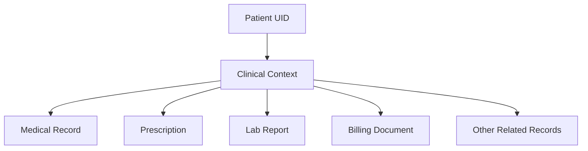
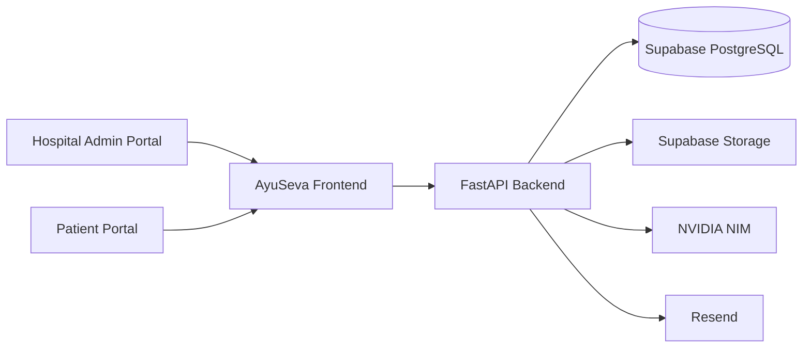
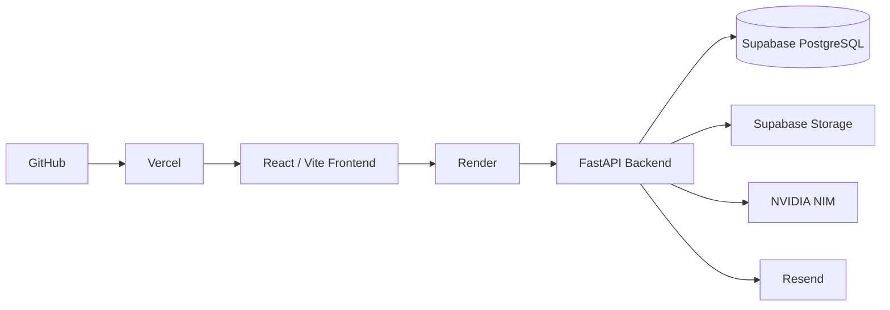
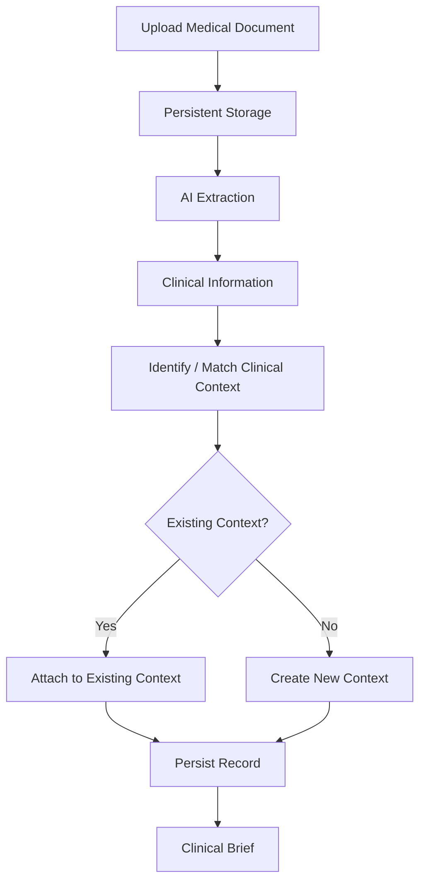
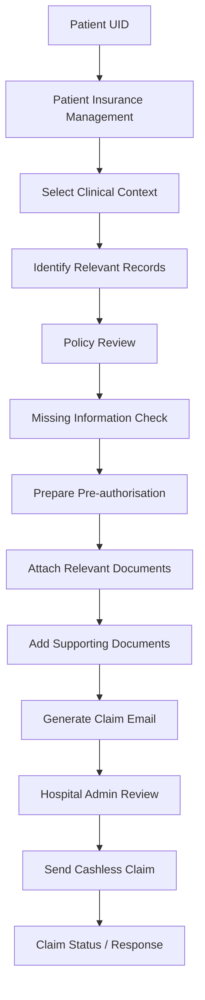

[README (2).md](https://github.com/user-attachments/files/31355919/README.2.md)
# AyuSeva

### AI-Powered Clinical Intelligence & Insurance Orchestration Platform

AyuSeva connects hospital clinical records, patient health information, insurance policies, and cashless claim workflows through a unified **Patient UID**.

It combines AI-powered medical document processing, clinical context management, patient-specific summaries, insurance intelligence, preventive-care workflows, and cashless claim preparation.

## 🚀 Live Demo

- **Frontend:** https://ayuseva-one.vercel.app/
- **Backend API:** https://ayuseva.onrender.com
- **GitHub:** https://github.com/arnavmittal0208-coder/Ayuseva

## 🎯 Problem

Healthcare information is scattered across medical reports, prescriptions, lab results, hospital records, insurance policies, bills, and estimates. This creates repetitive manual work and makes it difficult to understand a patient's complete clinical picture.

Insurance workflows add further complexity because hospitals may need to locate the correct clinical records, interpret policy requirements, prepare claim information, collect supporting documents, and communicate with insurers or TPAs.

## 💡 Solution

AyuSeva creates a unified workflow around a **Patient UID**.

Medical documents are processed by AI, organized into meaningful **Clinical Contexts**, and used to generate patient-specific clinical summaries. The same patient and insurance information can then support preventive-care workflows and context-specific cashless claim preparation.

```text
Patient UID
    ↓
Medical Records
    ↓
AI Document Processing
    ↓
Clinical Context
    ↓
Clinical Summary
    ↓
Insurance Policy
    ↓
Cashless Claim
```

## ✨ Key Features

### Hospital Admin Portal
- Patient directory and Patient UID management
- Medical document ingestion
- Clinical context management
- AI-generated clinical summaries
- Insurance policy management
- Preventive-care management
- Cashless claim preparation and submission

### AI Clinical Intelligence
- Medical document parsing and extraction
- Clinical condition identification
- Context-aware document matching
- Persistent patient-specific clinical contexts
- Clinical summaries with overview and clinical progression
- Medication and current-status information

### Insurance Management
- Insurance document upload
- Policy-data extraction
- Active and historical policy management
- Preventive Care Benefits
- Automated preventive-care notifications
- Insurer contact extraction

### Cashless Claims
- Select the relevant clinical context
- Identify relevant medical records
- Review policy-related information
- Detect missing information
- Prepare cashless/pre-authorisation information
- Attach AI-selected documents
- Add manual supporting documents such as bills and estimates
- Generate professional insurer/TPA email
- Send claim package
- Track claim status

### Patient Portal
- Patient-specific health overview
- Shared clinical summaries
- Health records
- Insurance information
- Preventive care
- Personal document vault

### Personal Documents
A separate patient-owned document area for storing personal files independently from hospital medical records and clinical summaries.

## 🧠 Clinical Context Architecture

A **Clinical Context represents an underlying medical condition or medical episode**, not a single uploaded file.

One context can contain many related documents.



Example:

```text
Diabetes
 ├── Diagnostic Report
 ├── Prescription
 ├── Laboratory Report
 ├── Medication Record
 └── Billing / Estimate
```

## 🗺️ Visual Architecture

The diagrams below are written in **Mermaid** so GitHub renders them directly as visual architecture and workflow diagrams.

## 🏗️ System Architecture



### Deployment Architecture

GitHub renders this diagram as a visual deployment architecture:



## 📄 Medical Document Processing



The system uses the **actual content of the document** to understand medical information rather than relying only on filenames.

## 💳 Cashless Claim Workflow



Core design principle:

```text
One Clinical Episode
        ↓
Multiple Related Documents
        ↓
One Cashless Claim
```

## 👤 Patient Data Isolation

AyuSeva uses the **Patient UID** as a central boundary for patient-specific records.

```text
Patient A
 ├── Clinical Contexts
 ├── Medical Records
 ├── Clinical Brief
 ├── Insurance
 └── Claims

Patient B
 ├── Clinical Contexts
 ├── Medical Records
 ├── Clinical Brief
 ├── Insurance
 └── Claims
```

## 🛠️ Technology Stack

| Layer | Technology |
|---|---|
| Frontend | React, Vite |
| Backend | Python, FastAPI |
| Database | PostgreSQL / Supabase |
| File Storage | Supabase Storage |
| AI | NVIDIA NIM |
| Email | Resend |
| Deployment | Vercel + Render |
| API | REST |

## 📂 Project Structure

```text
Ayuseva/
├── frontend/
│   ├── src/
│   ├── public/
│   └── package.json
├── backend/
│   ├── app/
│   │   ├── routers/
│   │   ├── services/
│   │   └── models.py
│   ├── tests/
│   └── requirements.txt
├── README.md
└── .gitignore
```

## ⚙️ Local Setup

### Clone

```bash
git clone https://github.com/arnavmittal0208-coder/Ayuseva.git
cd Ayuseva
```

### Frontend

```bash
cd frontend
npm install
npm run dev
```

### Backend

```bash
cd backend
pip install -r requirements.txt
python -m uvicorn app.main:app --reload
```

## 🔑 Environment Variables

Never commit real credentials.

Typical backend variables include:

```env
DATABASE_URL=
SUPABASE_URL=
SUPABASE_SERVICE_ROLE_KEY=
NVIDIA_API_KEY=
RESEND_API_KEY=
FRONTEND_URL=
MOCK_EMAIL=
```

Frontend:

```env
VITE_BASE_URL=
```

Use `.env.example` templates where provided.

## 🧪 Testing

The project includes backend tests covering areas such as clinical context persistence and matching, patient isolation, clinical summary behavior, document ingestion, insurance workflows, cashless claim workflows, email safety, and storage behavior.

Run:

```bash
pytest
```

## 🚀 Deployment

Current deployment architecture:

```text
GitHub
   ↓
Vercel
   ↓
React / Vite Frontend
   ↓
Render
   ↓
FastAPI Backend
   ↓
Supabase PostgreSQL + Storage
   ↓
NVIDIA NIM / Resend
```

### Current Deployment

- **Frontend:** https://ayuseva-one.vercel.app/
- **Backend:** https://ayuseva.onrender.com

## 🔐 Security

Implemented security-related measures include:

- Patient UID-based data isolation
- Server-side handling of secrets
- Supabase-backed persistent document storage
- Separation of personal documents from clinical records
- Claim-specific document handling
- Mock-safe email testing
- `.gitignore` protection for environment files and local artifacts

### Prototype Limitation

AyuSeva is currently a hackathon/prototype implementation. A full production healthcare deployment would require stronger authentication and authorization, audit logging, compliance controls, monitoring, formal privacy/security processes, and real insurer/TPA integrations.

## 📌 Limitations

- Direct insurer/TPA integrations are not yet implemented.
- Some insurer responses are represented through prototype workflows.
- Authentication is currently suitable for the prototype environment.
- Free-tier infrastructure may have cold-start or service limitations.
- AI and email functionality depends on external services and account limits.

## 🔮 Future Scope

- Real insurer and TPA integrations
- Reimbursement claim workflows
- Stronger authentication and authorization
- Enterprise audit logging
- Production-grade monitoring
- Broader hospital integrations
- Advanced AI clinical decision support
- Automated claim-response handling
- Multi-hospital and large-scale deployment

## 🌍 Real-World Impact

AyuSeva aims to reduce repetitive administrative work by connecting clinical information and insurance workflows around one patient identity.

```text
Patient UID
    ↓
Clinical Context
    ↓
Relevant Medical Records
    ↓
Clinical Summary
    ↓
Insurance Policy
    ↓
Cashless Claim
```

## 🏁 Project Status

**AyuSeva is an active prototype deployed for demonstration and evaluation.**

The platform is designed to evolve into a scalable healthcare and insurance orchestration solution.

## 🔗 Links

- **GitHub:** https://github.com/arnavmittal0208-coder/Ayuseva
- **Live Demo:** https://ayuseva-one.vercel.app/
- **Backend API:** https://ayuseva.onrender.com

## 👥 Team

### Team Crafting Table

Built as a healthcare technology prototype focused on clinical intelligence, patient data organization, and insurance workflow automation.
