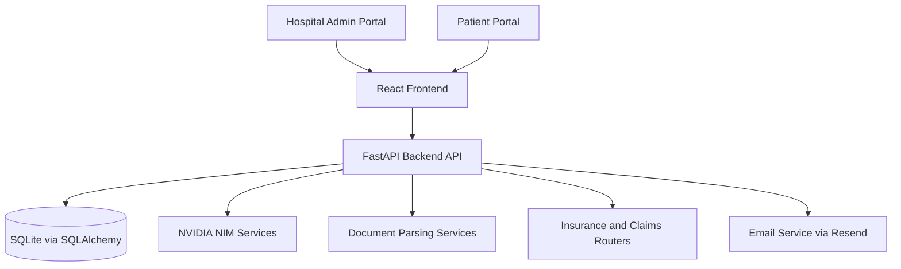
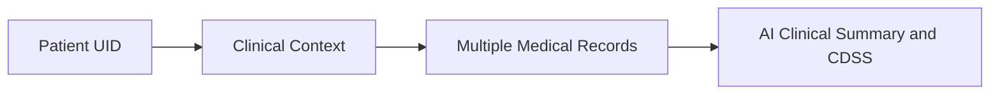
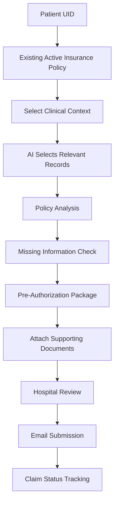
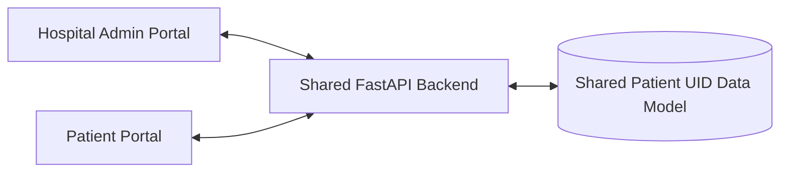

# AyuSeva

**AI-Powered Longitudinal Health, Insurance, and Cashless Claims Orchestration Platform**

AyuSeva is a dual-portal healthcare prototype that helps hospitals and patients organize medical records, generate AI-assisted clinical context and summaries, manage insurance policies, and automate key pre-authorization workflows for cashless claims.

## Problem Statement
Healthcare records are often fragmented across PDFs, scans, and multiple providers. This creates:
- Slow doctor decision-making due to scattered records
- Repeated manual paperwork for insurance pre-authorization
- Missed preventive-care entitlements under active policies
- Poor continuity across patient, hospital, and insurer touchpoints

## AyuSeva Solution
AyuSeva creates a UID-scoped longitudinal record system where:
- Every patient is mapped to a local Patient UID
- Clinical documents are parsed into structured JSON
- Records are grouped into persistent Clinical Contexts
- AI-generated clinical briefs are cached and refreshed on data change
- Insurance policy data is extracted from policy documents
- Cashless claims are prepared with context-relevant records and email-ready packages

## Why AyuSeva Is Different
- Active orchestration, not passive document storage
- End-to-end linkage from Patient UID to clinical context to insurance claim actions
- Context-aware claim preparation (relevant records, policy checks, missing-info audit)
- Unified hospital and patient experiences over a shared backend data model

## Key Features

### Hospital Admin Portal
- Patient registration with generated local UID
- Patient directory and profile workspace
- Medical record upload and deletion
- AI clinical summary and CDSS view
- Insurance profile management and policy history
- Cashless claim creation, review, and submission workflow

### Patient Portal
- Login using Patient UID
- Read-only timeline and records pages
- Clinical summary download/print experience
- Insurance policy view with preventive-checkup scheduler
- Personal Documents vault (separate storage model)

### Patient UID Architecture
- Patient UID (for example, CARE-XXXXXX) is the primary patient key
- All core entities are linked by patient_id
- API access patterns are primarily patient-scoped routes

### AI Medical-Document Ingestion
- Medical records and policy documents can be uploaded as PDF/image
- NVIDIA NIM models parse clinical and policy fields
- Parsed output is persisted as structured JSON per record

### Clinical Context Architecture
- Records are mapped to persistent ClinicalContext rows
- Contexts are used for disease-focused briefing and claim scoping
- Existing records can be consolidated/migrated into cleaned context clusters

### AI Clinical Summary / CDSS
- Summary modes include complete, recent, and disease-focused
- Brief output includes active problems, medications, warnings, and relevance metrics
- Brief caching uses a deterministic records hash for invalidation

### Insurance Policy Management
- Active policy storage with historical policy tracking
- Policy upload, archive, and protected deletion rules
- Policy fields include insurer, policy number, dates, sum insured, benefits, limitations, and insurer email

### Preventive Care Benefits
- Checkup slots derived from policy checkups_per_year
- Slot scheduling with notification_date = scheduled_date - 2 days
- Auto-locking when notification send succeeds
- Developer preview endpoint for notification content

### Personal Documents Vault
- Separate PersonalDocument table from hospital EMR records
- Per-patient storage cap enforcement (2 GB)
- Upload/download/delete lifecycle support

### Cashless Claim Workflow
- Claim initialization from selected clinical context
- AI policy and relevance analysis scaffold
- Missing-information and required-document signaling
- Supporting-document attachment support
- Claim email packaging and status transitions

### AI Policy/Document Analysis
- Policy parsing for insurer metadata, benefits, limitations, and preventive eligibility
- Claim analysis for relevance, policy check status, and form prefill

### Claim Document Selection and Attachment
- Selected EMR records stored on claim
- Additional supporting documents can be uploaded and attached to submission payloads

### Email / Resend Integration
- HTML email dispatch via Resend service
- Test and mock-safe behavior during pytest or MOCK_EMAIL mode
- Error-aware status transitions (Sent vs Failed)

### Security and Patient-Data Isolation
- Data model enforces per-patient foreign key boundaries
- Claims, checkups, records, and personal documents are patient-linked
- Insurance documents are excluded from clinical timeline/brief APIs
- Personal documents remain separate from hospital EMR workflow

## System Architecture



## Clinical Context Architecture



## Cashless Claim Workflow



## Patient and Hospital Portal Relationship



## Database Relationships
Core ORM models are defined in backend/app/models.py.

- Patient
  - 1:N Record
  - 1:N Claim
  - 1:N InsurancePolicy
  - 1:N PersonalDocument
  - 1:N ScheduledCheckup
  - 1:N ClinicalContext
- Record -> optional ClinicalContext
- Claim -> optional ClinicalContext + optional Policy reference
- InsurancePolicy -> 1:N ScheduledCheckup
- ClinicalBrief stores cached summary payloads keyed by patient and query dimensions

## Project Structure

```text
.
├── backend/
│   ├── app/
│   │   ├── config.py                 # Environment-based settings
│   │   ├── database.py               # SQLAlchemy engine/session/base
│   │   ├── main.py                   # FastAPI app bootstrap + startup tasks
│   │   ├── models.py                 # ORM models and relationships
│   │   ├── routers/                  # API route modules
│   │   │   ├── patients.py           # Patient, timeline, brief, contexts
│   │   │   ├── records.py            # Medical/policy uploads, record feed
│   │   │   ├── insurance.py          # Policies, checkups, notifications
│   │   │   ├── claims.py             # Cashless claims lifecycle
│   │   │   └── personal_documents.py # Personal vault APIs
│   │   └── services/                 # AI parsing, briefing, claims, email
│   ├── tests/                        # Backend pytest suite
│   ├── requirements.txt
│   └── .env.example
├── frontend/
│   ├── src/
│   │   └── App.jsx                   # Main dual-portal frontend flow
│   ├── package.json
│   └── .env.example
├── README.md
└── docs and planning markdown/html files
```

## Technology Stack
- Frontend: React, Vite, Tailwind CSS, Recharts, Lucide
- Backend: FastAPI, SQLAlchemy, Pydantic, Uvicorn
- Database: SQLite (default local mode)
- AI: NVIDIA NIM APIs for parsing and summarization
- Email: Resend API integration with mock/test fallbacks
- Testing: Pytest (backend integration and service behavior)

## Setup and Installation

### Prerequisites
- Python 3.10+
- Node.js 18+
- npm

### 1) Clone and enter project

```bash
git clone <your-fork-or-repo-url>
cd Health
```

### 2) Backend setup

```bash
cd backend
python -m venv .venv
.venv\Scripts\activate
pip install -r requirements.txt
copy .env.example .env
```

Update backend/.env with your own values.

### 3) Frontend setup

```bash
cd ../frontend
npm install
copy .env.example .env
```

### 4) Run backend

```bash
cd ../backend
.venv\Scripts\activate
uvicorn app.main:app --reload --port 8000
```

### 5) Run frontend

```bash
cd ../frontend
npm run dev
```

Frontend default URL: http://localhost:5173

## Environment Variables

### Backend (backend/.env)
- DATABASE_URL
- GEMINI_API_KEY
- RESEND_API_KEY
- NVIDIA_API_KEY
- MOCK_EMAIL
- PORT
- FRONTEND_URL (your Vercel frontend URL to permit CORS)
- SUPABASE_URL (your Supabase project URL for cloud file storage)
- SUPABASE_SERVICE_ROLE_KEY (your Supabase API service role key)

### Frontend (frontend/.env)
- VITE_API_BASE_URL (reserved for configurable API URL usage)

## Local Development Notes
- Current frontend code uses a localhost API base configured in source.
- SQLite tables are auto-created at startup.
- Startup includes migration-style checks and a background preventive-checkup worker.

## Testing
Backend tests are under backend/tests.

Run:

```bash
cd backend
.venv\Scripts\activate
python -m pytest
```

## Deployment Architecture (Current State)
- Current repository is optimized for local development/demo workflows.
- No production deployment manifests (for example, Dockerfile, Procfile, CI workflows) are currently included.
- Docs reference intended split deployment (frontend and backend) but deployment automation is not yet codified in this repository.

## Security Model (Current Implementation)
- UID-scoped data model with patient_id linkage across domain entities
- Personal-document vault stored in separate table from medical record timeline
- Insurance records excluded from clinical timeline endpoint payloads
- Environment-variable based secret loading via backend config
- Email sending has mock bypass in test contexts

### Important Authentication Note
- Current authentication is frontend-session style (localStorage + role view state) and not enforced as backend auth middleware.
- This is prototype-friendly but not sufficient for public production security.

## Known Limitations
- Insurer/TPA response lifecycle includes simulation endpoints for prototype flows
- Preventive checkup notifications use a prototype-oriented automation loop
- Email behavior may depend on sandbox restrictions and configured sender rules
- Backend authorization guards are not yet implemented for production-grade role enforcement
- Deployment manifests and CI pipelines are not yet included

## Future Scope
- Backend auth and role-based access control middleware
- Production secret management and key rotation workflows
- CI/CD, containerization, and cloud deployment manifests
- Richer insurer integrations beyond email-based flow
- Enhanced audit trails and compliance-focused access logging

---

If you are reviewing this repository for hackathon or technical submission purposes, start with:
1. Backend routes in backend/app/routers/
2. Core model relationships in backend/app/models.py
3. Main UI orchestration in frontend/src/App.jsx
4. Test suite in backend/tests/
