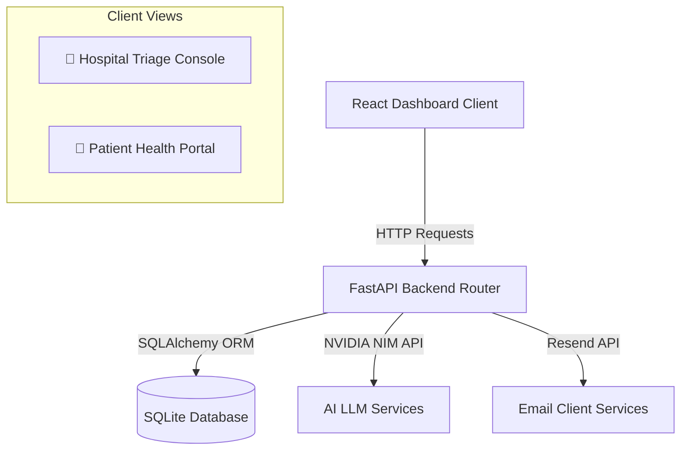
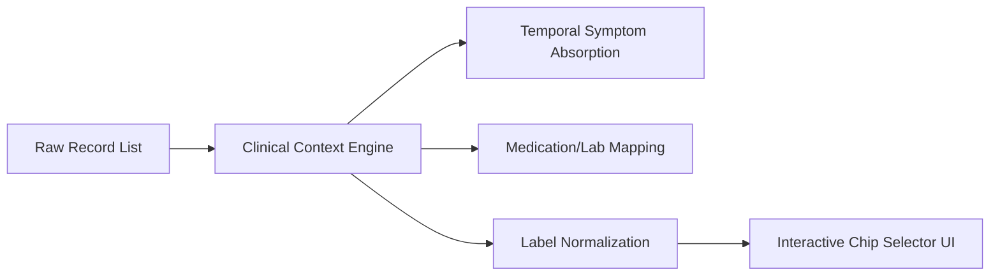
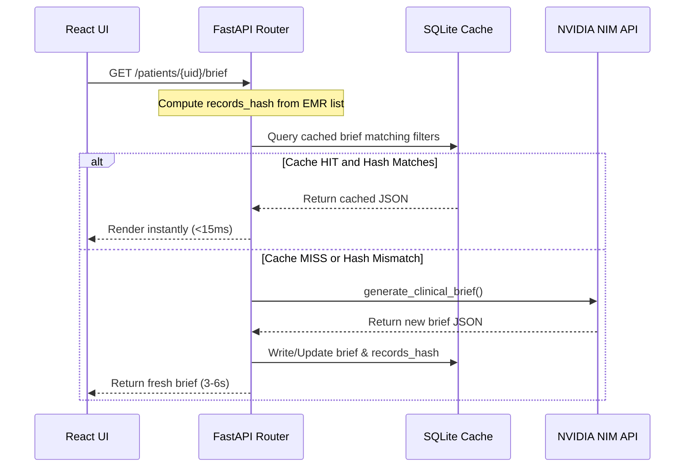

# AyuSeva Care & Claims Orchestration Platform: Comprehensive System Architecture

This document provides a detailed overview of the system architecture, service layers, AI components, caching layers, and validation setups implemented on the **AyuSeva** platform.

---

## 🏗️ 1. System Overview

AyuSeva is a unified healthcare platform connecting hospital triage teams and patients to automate medical record parsing, longitudinal clinical summary generation, cashless pre-authorization, and preventive checkup scheduling.



---

## 💾 2. Database & Data Models

The system runs on a local SQLite database (`health_platform.db`) managed via SQLAlchemy ORM. All relationships leverage cascading delete operations to ensure database integrity.

### Data Models ([models.py](file:///c:/Users/Arnav%20Mittal/Desktop/Health/backend/app/models.py))

*   **`Patient`**: Stores details such as Name, Phone Number, Date of Birth, and Policy Details (JSON object storing Insurer, Policy Name, Co-pay details, and checkup count).
*   **`Record`**: Houses ingested EMR details including parsed JSON segments, uploaded file paths (PDFs/Images), record dates, and record types (Prescription, Lab Report, Discharge Summary).
*   **`Claim`**: Auto-scaffolds pre-auth statuses (Draft, Submitted, Approved, Rejected), estimated costs, advised procedures, and checklists of missing documents.
*   **`ClinicalBrief`**: Persists generated patient summaries matching specific query conditions to avoid duplicate LLM invocations.

---

## 🧠 3. EMR Ingestion & AI Parsing Service

### Ingestion Pipeline ([parser.py](file:///c:/Users/Arnav%20Mittal/Desktop/Health/backend/app/services/parser.py))

1.  **File Uploads:** Hospital staff upload scanned reports or prescriptions.
2.  **Multimodal OCR Processing:**
    *   **PDF Documents:** Extracted text is fed to `meta/llama-3.3-70b-instruct` to parse fields.
    *   **Scanned Images:** Sent directly to `meta/llama-3.2-11b-vision-instruct` via base64 encoding for visual extraction.
3.  **JSON Structuring:** Generates a structured dictionary containing dates, diagnoses, prescribed medications, doses, frequencies, and lab test biomarkers.

---

## ⚡ 4. Automatic Clinical Context System

Rather than relying on manual input, the platform compiles active disease profiles using an auto-detection engine ([clinical_context.py](file:///c:/Users/Arnav%20Mittal/Desktop/Health/backend/app/services/clinical_context.py)).



### Context Engine Rules
*   **Temporal Symptom Absorption:** Links acute complaints (e.g. fever) to final diagnoses (e.g. Typhoid) if they occur within a 21-day window.
*   **Medication/Lab Mapping:** Associates related drugs (e.g. Metformin) or biomarker tests (e.g. HbA1c) to context clusters even if the name of the disease is omitted in the record.
*   **Label Normalization:** Groups raw diagnoses under broader standard conditions (e.g. `Type 2 diabetes mellitus` maps to `Diabetes` on UI buttons while preserving the raw name inside summaries).
*   **Interactive Selector Chips:** Selected context chips dynamically toggle filters on the UI to load relevant patient summaries. Excluded records are collapsed into an "Excluded History" section, explaining why they are not relevant.

---

## 🧠 5. AI Clinical Brief & CDSS Engine

The clinical brief generator ([clinical_brief.py](file:///c:/Users/Arnav%20Mittal/Desktop/Health/backend/app/services/clinical_brief.py)) compiles longitudinal patient records using `meta/llama-3.3-70b-instruct`.

### Summary Modes
*   **Complete History:** A longitudinal chronological timeline followed by a progression summary.
*   **Recent Updates:** Filters recent clinical changes, physician visits, and medication updates.
*   **Current Visit:** Synthesizes the EMR focusing on a specified reason for the current visit.
*   **Disease Specific:** Compiles progression specifically for a selected Clinical Context condition.
*   **Emergency Summary:** Formulates critical data (allergies, warning markers, active medications) for immediate triaging.

### Clinical Decision Support System (CDSS)
*   **Drug-Allergy Alerts:** Identifies drug prescription conflicts against documented patient allergy profiles.
*   **Therapeutic Duplication:** Warns doctors if multiple drugs of the same therapeutic class are prescribed concurrently.
*   **Document Citations:** Inserts record ID citations (e.g. `[Record #2]`) next to problems, warnings, and medications.

---

## ⚡ 6. Persistent Brief Caching & Invalidation

To guarantee instantaneous patient switching without repeating expensive NVIDIA NIM API requests, a database caching pipeline is integrated into the `/brief` router.



### Core Caching Abstractions ([patients.py](file:///c:/Users/Arnav%20Mittal/Desktop/Health/backend/app/routers/patients.py))
1.  **Deterministic Records Fingerprint:** 
    `_calculate_records_hash` sorts a patient's EMR list by ID and generates a SHA-256 hash of their record types, dates, and parsed contents. Any new file upload, edit, or deletion changes this hash, invalidating the cache.
2.  **Debounced Loading UX:**
    `briefLoading` state in [`App.jsx`](file:///c:/Users/Arnav%20Mittal/Desktop/Health/frontend/src/App.jsx) uses a 250ms delay timer. For cache hits (resolving in ~10ms), the UI switches instantly without showing any loading indicators. The text `"Reading historical EMR to generate brief..."` only displays when a new LLM generation is genuinely required.
3.  **Failsafe Parser Resilience:**
    Added regex cleaning inside [`clinical_brief.py`](file:///c:/Users/Arnav%20Mittal/Desktop/Health/backend/app/services/clinical_brief.py) to parse non-standard LLM JSON outputs (e.g. backtick-wrapped multiline strings or raw control newlines), eliminating parser-level 500 errors.

---

## 👤 7. Patient Portal Summary Selector

Rather than printing a generic timeline, the Patient Portal provides patients with a clean interface to choose which summary they want to print or download.

*   **Relative Dropdown Popover:** Replaced the static print button with a relative dropdown container listing available summaries.
*   **Z-Index & Position Constraints:** Resolved layout clipping issues in [`App.jsx`](file:///c:/Users/Arnav%20Mittal/Desktop/Health/frontend/src/App.jsx) by adding `z-20` and removing `overflow-hidden` on the Hero container, allowing the popover to float cleanly above elements below it.
*   **Dynamic Summary Options:** Automatically populates the dropdown with `Complete History`, `Recent Updates`, and dynamically detected clinical context options (e.g. `[ Diabetes ]`, `[ Hypertension ]`).
*   **PDF Export Compiler:** Formats the selected summary mode, active problems, medications, CDSS warnings, and relevance metrics into a clean printable stylesheet.

---

## 🛡️ 8. Security & Patient Data Isolation

Data isolation is enforced at every layer to prevent patient data leakage:
*   **No Global Abstractions:** Removed global endpoints (like list claims) to prevent general enumeration. All claims are fetched using scoped query patterns (`GET /api/claims/patient/{uid}`).
*   **Frontend State Resetting:** Switching patients triggers `clearPatientScopedState` in [`App.jsx`](file:///c:/Users/Arnav%20Mittal/Desktop/Health/frontend/src/App.jsx) which immediately clears all local hooks (`activePatient`, `timeline`, `claims`, `clinicalBrief`), preventing stale data flashes during network swaps.
*   **Clean Sidebar Updates:** When a patient load request returns a 404 error (e.g. because they were deleted), the catch block resets the active patient and refetches the lookup list, instantly removing the stale patient from the sidebar.
*   **Test Data Purging:** Automated test scripts are wrapped in a strict `try...finally` block that connects to SQLite with foreign keys enabled (`PRAGMA foreign_keys = ON;`) and deletes the registered test patients upon test completion, keeping the local database clean.

---

## 🔬 9. Verification & Test Execution

### 1. In-Process Caching Integration Suite ([test_caching.py](file:///c:/Users/Arnav%20Mittal/Desktop/Health/backend/tests/test_caching.py))
*   **What it does:** Mocks the LLM generator in-process, registers a patient, fetches the initial brief, asserts that the second fetch hits the cache (taking <15ms), uploads a record to trigger invalidation, and asserts that the third fetch re-generates the brief.
*   **Outcome:** `10 Passed` successfully.
    ```bash
    tests\test_caching.py .                                                  [ 10%]
    tests\test_clinical_context.py .........                                 [100%]
    ======================= 10 passed in 0.69s ========================
    ```

### 2. Patient Isolation Test ([test_isolation.py](file:///c:/Users/Arnav%20Mittal/.gemini/antigravity-ide/brain/50d7deb2-ca04-4ca1-a84e-f8356f317fbe/scratch/test_isolation.py))
*   **What it does:** Spawns two distinct test patients, uploads isolated EMR records (prescription vs. lab report), queries their timelines/briefs, and asserts that no records or summary details leak across patients.
*   **Outcome:** Successful.
    ```bash
    --- Starting Patient Data Isolation Verification ---
    Created Patient A: Patient A (CARE-532216)
    Created Patient B: Patient B (CARE-169699)
    Timelines successfully verified as empty for new patients.
    Inserted distinct EMR records for Patient A and Patient B directly into SQLite.
    Timelines are perfectly isolated.
    Claims are verified as isolated and empty.
    AI Clinical Summaries are perfectly isolated!
    Successfully cleaned up isolation test patients.
    ```
